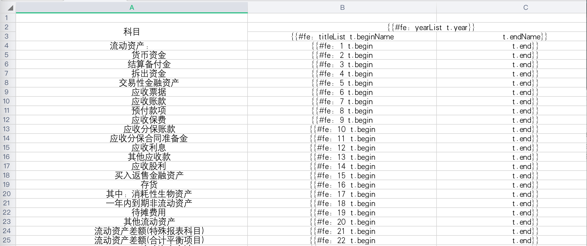
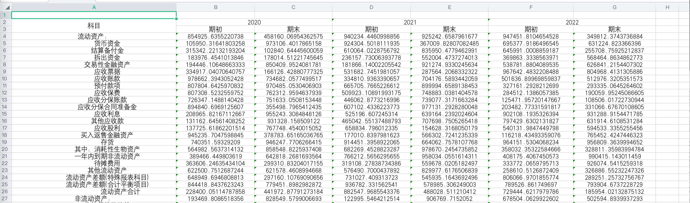

# easypoi-exmaple

Easypoi 功能如同名字easy，主打的功能就是容易，让一个没接触过poi的人员，就可以方便的写出Excel导出、Excel模板导出、Excel导入、Word模板导出，通过简单的注解和模板语言(熟悉的表达式fe语法)，完成以前复杂的写法<br>
开源地址：https://gitee.com/lemur/easypoi

**独特的功能**

* 基于注解的导入导出,修改注解就可以修改Excel
* 支持常用的样式自定义
* 基于map可以灵活定义的表头字段
* 支持一堆多的导出,导入
* 支持模板的导出,一些常见的标签,自定义标签
* 支持HTML/Excel转换,如果模板还不能满足用户的变态需求,请用这个功能
* 支持word的导出,支持图片,Excel

更多特性与功能详解：[easypoi官网说明](http://doc.wupaas.com/docs/easypoi/easypoi-1c0u6ksp2r091)

**官方demo**
官网实例工程：[easypoi-test](https://gitee.com/lemur/easypoi-test)

##  模板导出效果

**模板定义**


**导出结果**



## 1. Excel实例
**一般模板导出**
测试类:`src/main/java/com/littlefox/easypoi/excel/ExcelTest.java`

- 导出单个sheet页 (singlesheet.xls)
- 导出多个Sheet页 (multisheet.xls)
- 导出单个对象 (singlesheet.xls)
- 导出List Map对象 (singlesheet.xls)
- 导出图片文件 (singlesheet.xls)
- 横向、纵向、换行导出 (horizontal.xlsx)

**复杂导出**
测试类:`src/main/java/com/littlefox/easypoi/excel/FinanceTest.java`

- 类似“财务报表-资产负债表”，模板为`src/main/resources/excel/finance.xlsx`
- Java实现自定义动态表头导出，无模板，数据格式为map

**导入**
测试类:`src/test/java/com/littlefox/easypoi/ImportTest`

- 读取指定xls文件导入，读取的数据结果分别通过实体类注解和map映射
- 支持导出列名相同的Excel文件

## 2. Word实例
测试类:`src/main/java/com/littlefox/easypoi/excel/WordTest`
- 导出单个对象
- 导出List Map对象
- 导出图片文件

> 模板文件为`src/main/resources/word/template.docx`

## 3. 性能测试
|模板  | 数据量(W) |   耗时(S)   |  导入/导出  |文件大小(MB)|
| ----| ---- | ---- | ---- | ----|
|singlesheet.xls|1 |46.77 |导出| 152.6 |
|singlesheet.xlsx|1 |60.01 |导出| 150.7 |
| dynaColFinance.csv | 109       | 3.86    | 导出      | 209.6    |
| template.docx      | 4         | 38.29   | 导出      | 0.85     |
| dynaColFinance.xls | 0.65      | 1.62    | 导入      | 2.2      |

> `JVM`大小统一设置为`-Xmx2048m -Xms2048m` 得出，仅供参考

## 4. 运行
```shell
# 执行打包，在target目录下生成easypoi-example.jar
mvn clean package -Dmaven.test.skip=true

# 运行
java -jar easypoi-example.jar
```

参数说明
```shell
--p      导出后的文件存放的根目录，例如：--p=D:/
--d      程序自动生成的数据数量，例如: --d=500，测试程序单个list将生成500条数据
--type   10(单sheet,xls格式);11(单sheet,xlsx格式);12(多sheet,xlsx格式);13(多sheet,xlsx格式);20(word,docx格式);30(excel,根据模板导出财务数据);40(excel,无模板动态导出财务数据);50(csv,无模板动态快速导出百万级数据)
--y      财务年度数据,产生多少年的数据，例如: --y=5，生成近5年的财务数据（可选：只适用于type=30/40/50）
```

示例: `java -jar easypoi-example.jar --p=D:/ --d=500 --type=10 -y=5`

> 导出模板文件在**src/main/resources/**文件夹中
> 导入模板文件在**src/test/resources/**文件夹中

## 5. 更多
* Excel导出XLS和XLSX区别
    - 导出时间XLS比XLSX更快
    - 导出大小XLS比XLSX更多
    - 大数据量时CSV最快，但导出动态表头存在bug
    - 导出需要综合网速和本地速度做考虑
* 建议运行时加上JVM内存设置: 例如 `-Xmx2048m -Xms2048m`
* Excel自适应xls和xlsx两种格式,word只支持2007及其以上的版本（即docx模式），不支持内嵌表格操作
* 实测不支持List嵌套循环，详见[issues](https://gitee.com/lemur/easypoi/issues/IB120?from=project-issue) ，不支持没有key遍历，如`"list":[1,2,3]`，正确应该为`"list":[{key1:1},{key2:2},{key3:3}]`
* 关于`]]`换行符，实测只能换3行，详见[issues](https://gitee.com/lemur/easypoi/issues/I1FQRM?from=project-issue#note_2702976)
* 当表头存在多个的时候，遍历的titlemap存在问题，key的逻辑错误，详见[issues](https://gitee.com/lemur/easypoi/issues/I1L3GI?from=project-issue)
* Map导入相同列名会有丢失数据的问题，原因列名重复导致存储map的key重复，目前好像没找到解决办法
* 遍历时默认map的值为空则不返回，通过设置`setKeyIndex(null)`可以解决该问题
* POI提供了HSSF、XSSF以及SXSSF三种方式操作Excel。
  - HSSF：Excel97-2003版本，扩展名为.xls。一个sheet最大行数65536，最大列数256。
  - XSSF：Excel2007版本开始，扩展名为.xlsx。一个sheet最大行数1048576，最大列数16384。
  - SXSSF：是在XSSF基础上，POI3.8版本开始提供的支持低内存占用的操作方式，扩展名为.xlsx。
* Excel版本兼容性是向下兼容。
